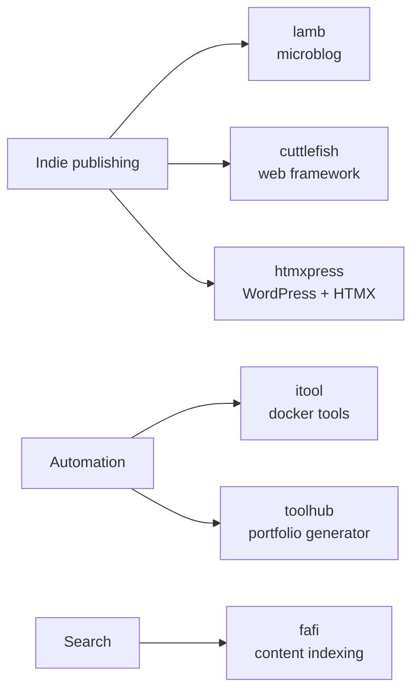

# Hi, I'm Sander 👋

Senior Web Engineer [@humanmade](https://github.com/humanmade). I build tools for indie publishing and the semantic web, mostly in **PHP**, **Python** and **Go** — plus the occasional Godot experiment and a lot of Linux automation.

🌐 [vandragt.com](https://vandragt.com) · 🐘 [micro.blog/sander](https://micro.blog/sander)

---

### 📡 Latest from my blog
<!-- BLOG-POST-LIST:START -->
- [It appears some hosters only support docker webapps with one volume mount #til](https://vandragt.com/status/270)
- [Keep an eye on Move Tab to Another Window – Get this Extension for 🦊 Firefox (en-US) as I just submitted this extension which... moves tabs to other w…](https://vandragt.com/status/269)
- [If the Slack instance has lost it's icon in the dock, you might need to correct the casing on the StartupWMClass to lowercase: #linux](https://vandragt.com/status/268)
- [Lamb 0.11.0 TL;DR](https://vandragt.com/lamb-0-11-0)
- [An idea: are there any nail clippers that collect the clippings in a compartment? I’d buy one!](https://vandragt.com/status/266)
<!-- BLOG-POST-LIST:END -->

---

### 🛠️ What I'm building

<b>📚 Publishing tools</b>

- [lamb](https://github.com/svandragt/lamb) — Literally Another Micro Blog
- [cuttlefish](https://github.com/svandragt/cuttlefish) — hackable web framework (WIP)
- [htmxpress](https://github.com/svandragt/htmxpress) — power WordPress with HTMX

<b>⚙️ Automation &amp; tooling</b>

- [itool](https://github.com/svandragt/itool) — local internal docker tools runner
- [toolhub](https://github.com/svandragt/toolhub) — generate a portfolio hub from your repos and gists
- [fafi](https://github.com/svandragt/fafi) — web content indexing and search (Go)

---

### 📊 Stats

