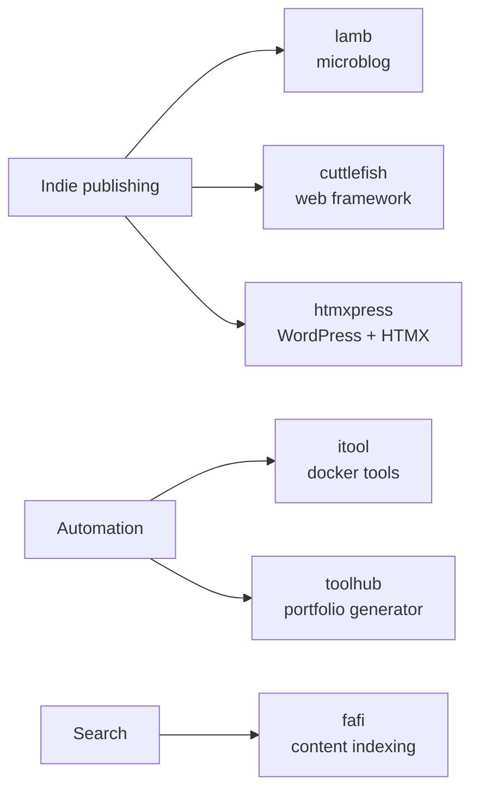

# Hi, I'm Sander 👋

Senior Web Engineer [@humanmade](https://github.com/humanmade). I build tools for indie publishing and the semantic web, mostly in **PHP**, **Python** and **Go** — plus the occasional Godot experiment and a lot of Linux automation.

🌐 [vandragt.com](https://vandragt.com) · 🐘 [micro.blog/sander](https://micro.blog/sander)

---

### 🚀 Latest releases
<!-- RELEASES-LIST:START -->
- 2026-08-03 — [plex-janitor 1.0.2](https://github.com/svandragt/plex-janitor/releases/tag/1.0.2)
- 2026-08-03 — [streamcables v0.2.0](https://github.com/svandragt/streamcables/releases/tag/v0.2.0)
- 2026-07-28 — [nethealth v0.1.0](https://github.com/svandragt/nethealth/releases/tag/v0.1.0)
- 2026-07-25 — [lamb 0.12.0](https://github.com/svandragt/lamb/releases/tag/0.12.0)
- 2026-07-24 — [sidewing 0.2.5](https://github.com/svandragt/sidewing/releases/tag/0.2.5)
<!-- RELEASES-LIST:END -->

---

### 📡 Latest from my blog
<!-- BLOG-POST-LIST:START -->
- 2026-08-06 — [Another AI evaluation resulting in real world harm. I feel the brazen way these AI escapades are described rejects both human accountability and that…](https://vandragt.com/status/293)
- 2026-07-31 — [Why not automatically update when the app is quitting? Yes sometimes this is when the computer shuts down, but often it isn’t, especially if the user…](https://vandragt.com/status/287)
- 2026-07-25 — [Lamb 0.12.0](https://vandragt.com/lamb-releases-lamb-0-12-0)
- 2026-07-15 — [I see Liam Proven of The Reg has decided to need to comment on every new software whether it’s ai assisted, ruining both his enthusiasm for said softw…](https://vandragt.com/status/277)
- 2026-07-28 — [Turtle is playing the long game](https://vandragt.com/turtle-is-playing-the-long-game)
<!-- BLOG-POST-LIST:END -->

---

### 🛠️ What I'm building

<b>📚 Publishing tools</b>

- [lamb](https://github.com/svandragt/lamb) — Literally Another Micro Blog
- [cuttlefish](https://github.com/svandragt/cuttlefish) — hackable web framework (WIP)
- [htmxpress](https://github.com/svandragt/htmxpress) — power WordPress with HTMX

<b>⚙️ Automation &amp; tooling</b>

- [itool](https://github.com/svandragt/itool) — local internal docker tools runner
- [toolhub](https://github.com/svandragt/toolhub) — generate a portfolio hub from your repos and gists
- [fafi](https://github.com/svandragt/fafi) — web content indexing and search (Go)

---

### 📊 Stats

---

