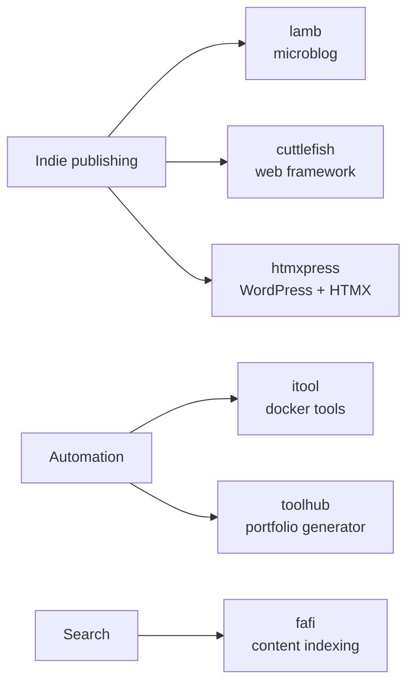

# Hi, I'm Sander 👋

Senior Web Engineer [@humanmade](https://github.com/humanmade). I build tools for indie publishing and the semantic web, mostly in **PHP**, **Python** and **Go** — plus the occasional Godot experiment and a lot of Linux automation.

🌐 [vandragt.com](https://vandragt.com) · 🐘 [micro.blog/sander](https://micro.blog/sander)

---

### 🚀 Latest releases
<!-- RELEASES-LIST:START -->
- 2026-09-14 — [park v1.1.0](https://github.com/svandragt/park/releases/tag/v1.1.0)
- 2026-09-09 — [lamb 0.15.0-rc1](https://github.com/svandragt/lamb/releases/tag/0.15.0-rc1)
- 2026-09-07 — [repoman 0.4](https://github.com/svandragt/repoman/releases/tag/0.4)
- 2026-08-27 — [hello-browser 0.3.0](https://github.com/svandragt/hello-browser/releases/tag/0.3.0)
- 2026-08-21 — [gala-xy v0.2.0](https://github.com/svandragt/gala-xy/releases/tag/v0.2.0)
<!-- RELEASES-LIST:END -->

---

### 📡 Latest from my blog
<!-- BLOG-POST-LIST:START -->
- 2026-09-14 — [park v1.1.0: syncing between machines](https://vandragt.com/park-v1-1-0-syncing-between-machines)
- 2026-09-14 — [viv 0.11.0, and a two-word deletion](https://vandragt.com/viv-0-11-0-and-a-two-word-deletion)
- 2026-09-11 — [The iPhone Duo seems interesting to me but mainly because of the “laptop mode” and being able to read content like Safari in landscape without needing…](https://vandragt.com/status/900)
- 2026-09-09 — [Lamb 0.15.0-rc1](https://vandragt.com/lamb-releases-0-15-0-rc1)
- 2026-09-09 — [Hey Sander, how did you manage to post photos from your phone using responsive image sizes in webp optimised format? Glad you asked, by installing Lam…](https://vandragt.com/status/899)
<!-- BLOG-POST-LIST:END -->

---

### 🛠️ What I'm building

<b>📚 Publishing tools</b>

- [lamb](https://github.com/svandragt/lamb) — Literally Another Micro Blog
- [cuttlefish](https://github.com/svandragt/cuttlefish) — hackable web framework (WIP)
- [htmxpress](https://github.com/svandragt/htmxpress) — power WordPress with HTMX

<b>⚙️ Automation &amp; tooling</b>

- [itool](https://github.com/svandragt/itool) — local internal docker tools runner
- [toolhub](https://github.com/svandragt/toolhub) — generate a portfolio hub from your repos and gists
- [fafi](https://github.com/svandragt/fafi) — web content indexing and search (Go)

---

### 📊 Stats

---

