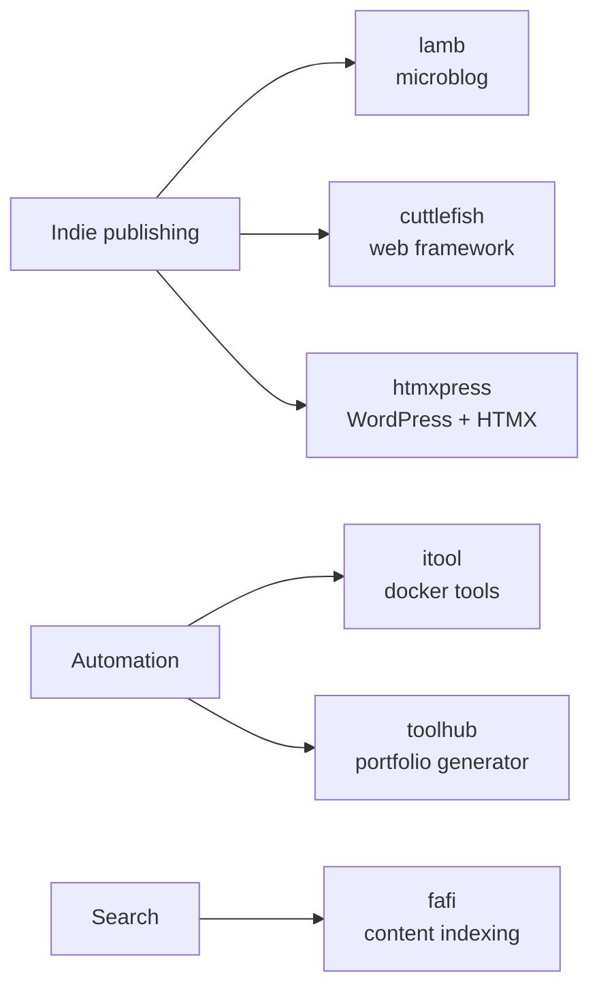

# Hi, I'm Sander 👋

Senior Web Engineer [@humanmade](https://github.com/humanmade). I build tools for indie publishing and the semantic web, mostly in **PHP**, **Python** and **Go** — plus the occasional Godot experiment and a lot of Linux automation.

🌐 [vandragt.com](https://vandragt.com) · 🐘 [micro.blog/sander](https://micro.blog/sander)

---

### 📡 Latest from my blog
<!-- BLOG-POST-LIST:START -->
- [I see Liam Proven of The Reg has decided to need to comment on every new software whether it’s ai assisted, ruining both his enthusiasm for said softw…](https://vandragt.com/status/277)
- [I keep learning things while working with agentic LLM and wanted to keep growing as I'm introduced to new concepts and solutions. So I built a small s…](https://vandragt.com/status/276)
- [Added split task tracking feature to my little TimeTracker app. Time is divided between the active tasks. So if you are updating personal goals, this…](https://vandragt.com/status/275)
- [This morning I built a minimal Sentry style local machine crash collector, it tries to add context to local crashes, then my elementaryOS patcher work…](https://vandragt.com/status/274)
- [Claude fixed another bug in elementaryOS, with notify-send notifications not showing up in the notification center after a sleep: Root cause was a GDK…](https://vandragt.com/status/273)
<!-- BLOG-POST-LIST:END -->

---

### 🛠️ What I'm building

<b>📚 Publishing tools</b>

- [lamb](https://github.com/svandragt/lamb) — Literally Another Micro Blog
- [cuttlefish](https://github.com/svandragt/cuttlefish) — hackable web framework (WIP)
- [htmxpress](https://github.com/svandragt/htmxpress) — power WordPress with HTMX

<b>⚙️ Automation &amp; tooling</b>

- [itool](https://github.com/svandragt/itool) — local internal docker tools runner
- [toolhub](https://github.com/svandragt/toolhub) — generate a portfolio hub from your repos and gists
- [fafi](https://github.com/svandragt/fafi) — web content indexing and search (Go)

---

### 📊 Stats

