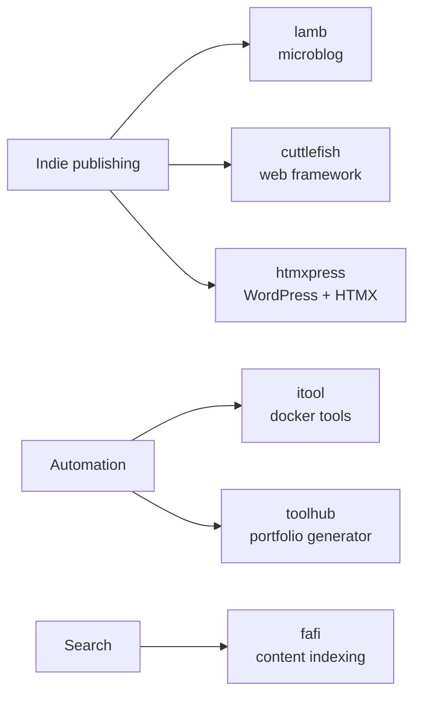

# Hi, I'm Sander 👋

Senior Web Engineer [@humanmade](https://github.com/humanmade). I build tools for indie publishing and the semantic web, mostly in **PHP**, **Python** and **Go** — plus the occasional Godot experiment and a lot of Linux automation.

🌐 [vandragt.com](https://vandragt.com) · 🐘 [micro.blog/sander](https://micro.blog/sander)

---

### 🚀 Latest releases
<!-- RELEASES-LIST:START -->
- 2026-09-16 — [jotta-tools 0.3](https://github.com/svandragt/jotta-tools/releases/tag/0.3)
- 2026-09-14 — [park v1.1.0](https://github.com/svandragt/park/releases/tag/v1.1.0)
- 2026-09-09 — [lamb 0.15.0-rc1](https://github.com/svandragt/lamb/releases/tag/0.15.0-rc1)
- 2026-09-07 — [repoman 0.4](https://github.com/svandragt/repoman/releases/tag/0.4)
- 2026-08-27 — [hello-browser 0.3.0](https://github.com/svandragt/hello-browser/releases/tag/0.3.0)
<!-- RELEASES-LIST:END -->

---

### 📡 Latest from my blog
<!-- BLOG-POST-LIST:START -->
- 2026-09-19 — [Shortcutting to output using AI gives me a similar feeling as using cheat codes when gaming , short term reward but skipping the interesting journey.](https://vandragt.com/status/909)
- 2026-09-18 — [viv 0.14.0 is out. It installs PHP dependencies from a composer.lock and writes the same vendor/ Composer would, byte for byte – 20 of 20 pinned proje…](https://vandragt.com/status/908)
- 2026-09-18 — [Run a weekly ClamAV scan that uses all your cores](https://vandragt.com/run-a-weekly-clamav-scan-that-uses-all-your-cores)
- 2026-09-18 — [It began as a question, whether a person directing coding agents can build a faster drop-in Composer, and that question is answered. The compatible mo…](https://vandragt.com/status/906)
- 2026-09-16 — [PHP 8.6 beta 3: Good to know #lamb is already compatible. 2342 tests, 4332 assertions, identical to an 8.4 control in the same image. Zero deprecation…](https://vandragt.com/status/905)
<!-- BLOG-POST-LIST:END -->

---

### 🛠️ What I'm building

<b>📚 Publishing tools</b>

- [lamb](https://github.com/svandragt/lamb) — Literally Another Micro Blog
- [cuttlefish](https://github.com/svandragt/cuttlefish) — hackable web framework (WIP)
- [htmxpress](https://github.com/svandragt/htmxpress) — power WordPress with HTMX

<b>⚙️ Automation &amp; tooling</b>

- [itool](https://github.com/svandragt/itool) — local internal docker tools runner
- [toolhub](https://github.com/svandragt/toolhub) — generate a portfolio hub from your repos and gists
- [fafi](https://github.com/svandragt/fafi) — web content indexing and search (Go)

---

### 📊 Stats

---

