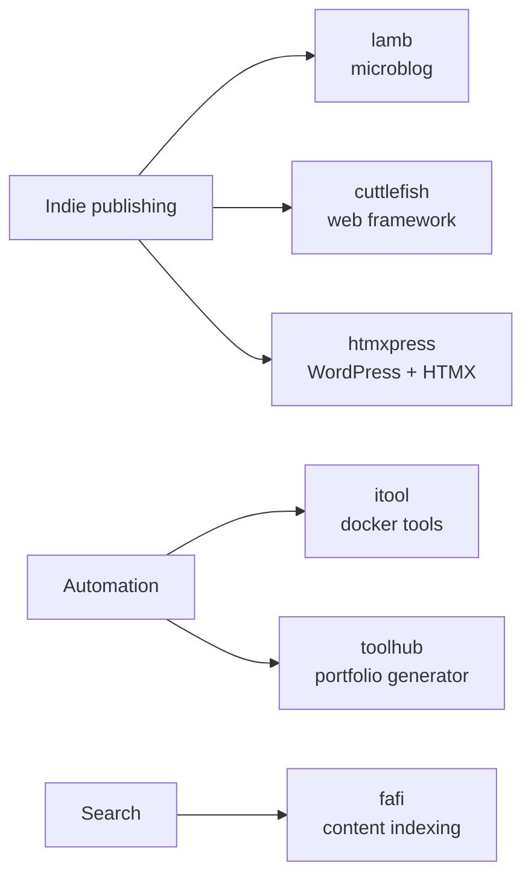

# Hi, I'm Sander 👋

Senior Web Engineer [@humanmade](https://github.com/humanmade). I build tools for indie publishing and the semantic web, mostly in **PHP**, **Python** and **Go** — plus the occasional Godot experiment and a lot of Linux automation.

🌐 [vandragt.com](https://vandragt.com) · 🐘 [micro.blog/sander](https://micro.blog/sander)

---

### 📡 Latest from my blog
<!-- BLOG-POST-LIST:START -->
- [Do I already own this game, and where? gamecheck searches your owned-game libraries across Steam, GOG, Epic and Amazon and prints any matches with the…](https://vandragt.com/status/263)
- [When your customer starts finding almost as much bugs as you found yourself, you're not leading into the right place. — Ex-Intel principal engineer, F…](https://vandragt.com/status/262)
- [Do I already own this game, and where? gamecheck searches your owned-game libraries across Steam, GOG, Epic and Amazon and prints any matches with the…](https://vandragt.com/status/261)
- [Hello Browser 0.2.0](https://vandragt.com/hello-browser-0-2-0)
- [Lamb 0.10.0](https://vandragt.com/lamb-0-10-0)
<!-- BLOG-POST-LIST:END -->

---

### 🛠️ What I'm building

<b>📚 Publishing tools</b>

- [lamb](https://github.com/svandragt/lamb) — Literally Another Micro Blog
- [cuttlefish](https://github.com/svandragt/cuttlefish) — hackable web framework (WIP)
- [htmxpress](https://github.com/svandragt/htmxpress) — power WordPress with HTMX

<b>⚙️ Automation &amp; tooling</b>

- [itool](https://github.com/svandragt/itool) — local internal docker tools runner
- [toolhub](https://github.com/svandragt/toolhub) — generate a portfolio hub from your repos and gists
- [fafi](https://github.com/svandragt/fafi) — web content indexing and search (Go)

---

### 📊 Stats

