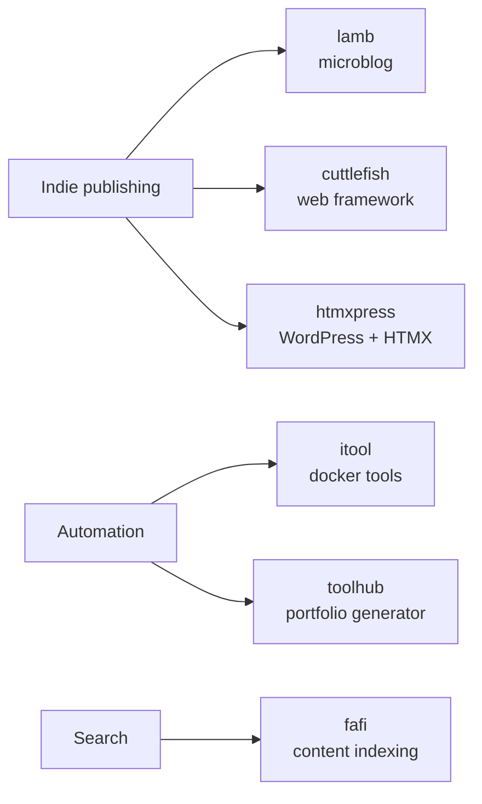

# Hi, I'm Sander 👋

Senior Web Engineer [@humanmade](https://github.com/humanmade). I build tools for indie publishing and the semantic web, mostly in **PHP**, **Python** and **Go** — plus the occasional Godot experiment and a lot of Linux automation.

🌐 [vandragt.com](https://vandragt.com) · 🐘 [micro.blog/sander](https://micro.blog/sander)

---

### 🚀 Latest releases
<!-- RELEASES-LIST:START -->
- 2026-10-06 — [vivace v0.21.0](https://github.com/svandragt/vivace/releases/tag/v0.21.0)
- 2026-09-21 — [gala-xy v0.3.0](https://github.com/svandragt/gala-xy/releases/tag/v0.3.0)
- 2026-09-16 — [jotta-tools 0.3](https://github.com/svandragt/jotta-tools/releases/tag/0.3)
- 2026-09-14 — [park v1.1.0](https://github.com/svandragt/park/releases/tag/v1.1.0)
- 2026-09-09 — [lamb 0.15.0-rc1](https://github.com/svandragt/lamb/releases/tag/0.15.0-rc1)
<!-- RELEASES-LIST:END -->

---

### 📡 Latest from my blog
<!-- BLOG-POST-LIST:START -->
- 2026-09-30 — [Let’s see if we can help out eBay and get some items sold https://listings.vandragt.com/](https://vandragt.com/status/917)
- 2026-09-30 — [Does Microsoft ever change? Learned today to install a UA switcher addon and switch to Edge for Windows and you get the new version of Teams with more…](https://vandragt.com/status/916)
- 2026-09-27 — [I can’t believe anyone just uses their phone as their main computing device. It’s so rubbish. Web page for insurance forms just reloads in the middle…](https://vandragt.com/status/914)
- 2026-09-23 — [mdex is a Markdown editor and exporter to Slack/Jira/Micropub powered blog. Write exporter plugins in JavaScript #projects #mdex](https://vandragt.com/status/913)
- 2026-09-23 — [I keep trying to get prose from ai agents that matches my style. But I think perhaps it’s more productive to summarise key points then write it myself…](https://vandragt.com/status/912)
<!-- BLOG-POST-LIST:END -->

---

### 🛠️ What I'm building

```mermaid
graph LR
    A[Indie publishing] --> lamb[lamb<br/>microblog]
    A --> cuttlefish[cuttlefish<br/>web framework]
    A --> htmxpress[htmxpress<br/>WordPress + HTMX]
    B[Automation] --> itool[itool<br/>docker tools]
    B --> toolhub[toolhub<br/>portfolio generator]
    C[Search] --> fafi[fafi<br/>content indexing]
```

<b>📚 Publishing tools</b>

- [lamb](https://github.com/svandragt/lamb) — Literally Another Micro Blog
- [cuttlefish](https://github.com/svandragt/cuttlefish) — hackable web framework (WIP)
- [htmxpress](https://github.com/svandragt/htmxpress) — power WordPress with HTMX

<b>⚙️ Automation &amp; tooling</b>

- [itool](https://github.com/svandragt/itool) — local internal docker tools runner
- [toolhub](https://github.com/svandragt/toolhub) — generate a portfolio hub from your repos and gists
- [fafi](https://github.com/svandragt/fafi) — web content indexing and search (Go)

---

### 📊 Stats

---

