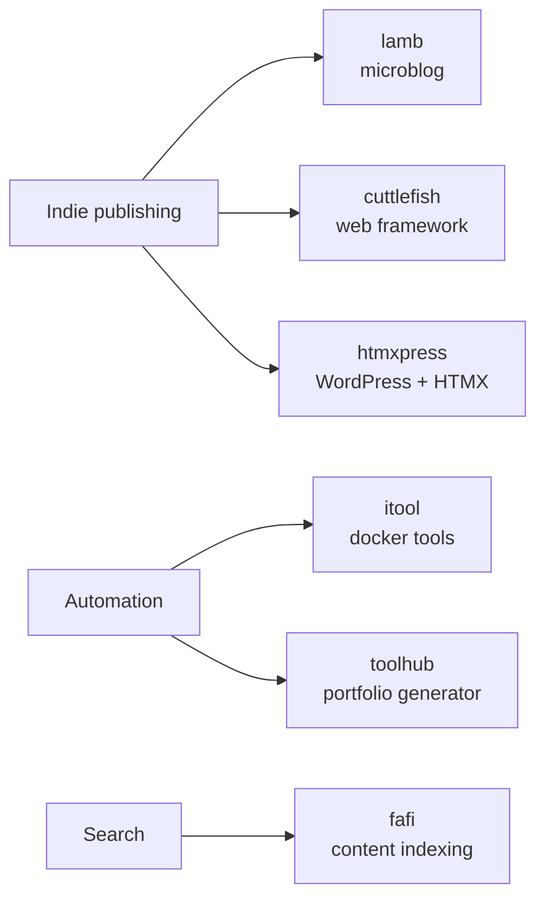

# Hi, I'm Sander 👋

Senior Web Engineer [@humanmade](https://github.com/humanmade). I build tools for indie publishing and the semantic web, mostly in **PHP**, **Python** and **Go** — plus the occasional Godot experiment and a lot of Linux automation.

🌐 [vandragt.com](https://vandragt.com) · 🐘 [micro.blog/sander](https://micro.blog/sander)

---

### 🚀 Latest releases
<!-- RELEASES-LIST:START -->
- 2026-10-30 — [park v1.2.0](https://github.com/svandragt/park/releases/tag/v1.2.0)
- 2026-10-28 — [vivace v0.23.0](https://github.com/svandragt/vivace/releases/tag/v0.23.0)
- 2026-10-27 — [lamb 0.15.0-rc2](https://github.com/svandragt/lamb/releases/tag/0.15.0-rc2)
- 2026-09-21 — [gala-xy v0.3.0](https://github.com/svandragt/gala-xy/releases/tag/v0.3.0)
- 2026-09-16 — [jotta-tools 0.3](https://github.com/svandragt/jotta-tools/releases/tag/0.3)
<!-- RELEASES-LIST:END -->

---

### 📡 Latest from my blog
<!-- BLOG-POST-LIST:START -->
- 2026-10-28 — [Created a fun real time walkie talkie app https://svandragt.github.io/over-and-out/ share a link with someone and get vintage realtime communication l…](https://vandragt.com/status/926)
- 2026-10-28 — [Got some items to sell? Build out a tinylistings instance and send some more eyes to your eBay listings. Demo: https://listings.vandragt.com/ . v1.0 j…](https://vandragt.com/status/925)
- 2026-10-20 — [herdr-dash: a board for my agent sessions](https://vandragt.com/herdr-dash-a-board-for-my-agent-sessions)
- 2026-10-20 — [Created a small script that allows you to save Windows groups so that when you focus one you focus all. Handy for companion apps.](https://vandragt.com/status/922)
- 2026-10-19 — [Love these QOL oneshot prompts: a small service now watches for the screen lock. When you lock, it pauses every media player that is playing. When you…](https://vandragt.com/status/921)
<!-- BLOG-POST-LIST:END -->

---

### 🛠️ What I'm building

```mermaid
graph LR
    A[Indie publishing] --> lamb[lamb<br/>microblog]
    A --> cuttlefish[cuttlefish<br/>web framework]
    A --> htmxpress[htmxpress<br/>WordPress + HTMX]
    B[Automation] --> itool[itool<br/>docker tools]
    B --> toolhub[toolhub<br/>portfolio generator]
    C[Search] --> fafi[fafi<br/>content indexing]
```

<b>📚 Publishing tools</b>

- [lamb](https://github.com/svandragt/lamb) — Literally Another Micro Blog
- [cuttlefish](https://github.com/svandragt/cuttlefish) — hackable web framework (WIP)
- [htmxpress](https://github.com/svandragt/htmxpress) — power WordPress with HTMX

<b>⚙️ Automation &amp; tooling</b>

- [itool](https://github.com/svandragt/itool) — local internal docker tools runner
- [toolhub](https://github.com/svandragt/toolhub) — generate a portfolio hub from your repos and gists
- [fafi](https://github.com/svandragt/fafi) — web content indexing and search (Go)

---

### 📊 Stats

---

